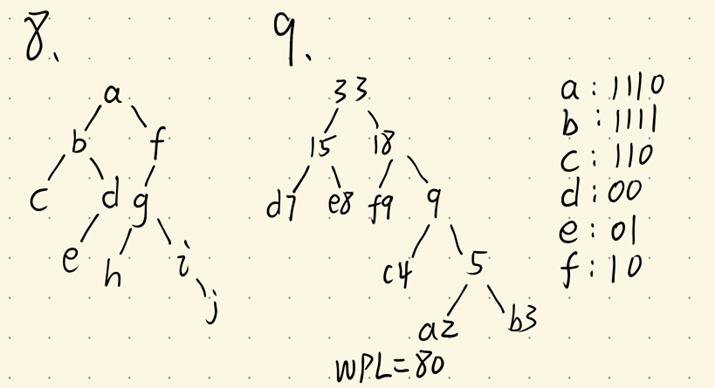

## 8. 9.



## 15.

```cpp
#include <string>
#include <iostream>
#include <queue>
using namespace std;
struct Node
{
    char val;
    int num;
    Node *left, *right;
    Node(int x) : num(x), left(nullptr), right(nullptr) {}
};
//root对于二叉树b，n对应第k层(物理序)
int levelnum(Node *root, int n)
{
    if (root == nullptr)
    {
        return 0;
    }
    if (n < 1)
    {
        return 0;
    }
    if (n == 1)
    {
        return 1;
    }

    queue<Node *> q;
    q.push(root);
    int depth = 1;

    while (!q.empty())
    {
        int levelSize = q.size();

        for (int i = 0; i < levelSize; i++)
        {
            Node *tmp = q.front();
            q.pop();

            if (tmp->left != nullptr)
            {
                q.push(tmp->left);
            }
            if (tmp->right != nullptr)
            {
                q.push(tmp->right);
            }
        }

        depth++;

        if (depth == n)
        {
            return q.size();
        }
    }

    return 0;
}

```

## 16 .

```cpp
#include <iostream>
#include <queue>
using namespace std;

struct TreeNode
{
    int val;
    TreeNode *left;
    TreeNode *right;
    TreeNode(int x) : val(x), left(nullptr), right(nullptr) {}
};

// 判断是否为完全二叉树
bool isCompleteTree(TreeNode *root)
{
    if (root == nullptr)
    {
        return true;
    }

    queue<TreeNode *> q;
    q.push(root);
    bool foundNull = false;

    while (!q.empty())
    {
        TreeNode *node = q.front();
        q.pop();

        if (node == nullptr)
        {
            foundNull = true;
        }
        else
        {

            if (foundNull)
            {
                return false;
            }

            q.push(node->left);
            q.push(node->right);
        }
    }

    return true;
}

```
