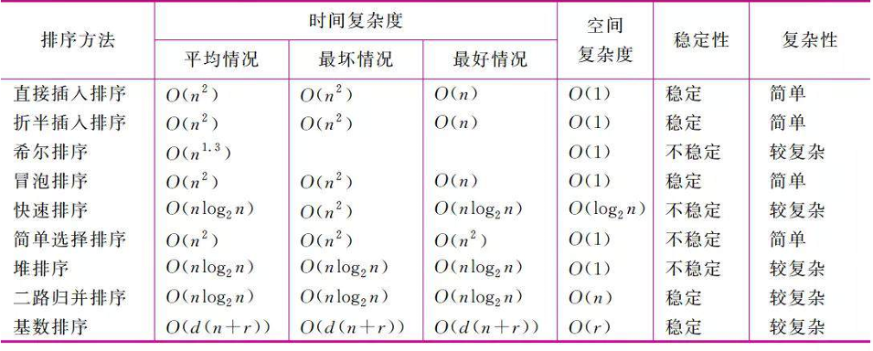

# 数据结构复习资料（完整详细版，1~27题）

使用方式：每题按“定义 -> 关键结论 -> 常考实现/复杂度 -> 易错点”复习。

---

## 1. 栈：定义、非法出栈、双栈共享、双栈协同

- 定义：栈是后进先出（LIFO）线性表，只允许在栈顶插入删除。
- 非法出栈序列判断：给定入栈序列，用辅助栈模拟。若能按目标序列全部弹出则合法，否则非法。
- 一个数组共享两个栈：
  - `top1` 从左向右增长，`top2` 从右向左增长；
  - 满条件：`top1 + 1 == top2`；
  - 优点：空间按需分配，减少浪费。
- 两栈协同：常用于逆序、分组重排、表达式转换等“单栈不便直接完成”的顺序控制。
- 复杂度：单次 `push/pop/top` 均 `O(1)`。
- 易错：判出栈序列不能靠直觉，必须模拟。

## 2. 线性表及主要性质

- 定义：由 `n` 个同类型数据元素构成的有限序列。
- 性质：
  - 元素有唯一前驱/后继（首元无前驱、末元无后继）；
  - 逻辑结构是一对一邻接关系；
  - 支持按位访问、插入、删除、查找。
- 常见存储：顺序表、链表。

## 3. 逻辑结构、数据元素、数据项、数据类型及联系

- 逻辑结构：元素间逻辑关系（集合、线性、树、图）。
- 数据元素：数据基本单位（如学生记录）。
- 数据项：构成数据元素的最小不可分单位（如学号、姓名）。
- 数据类型：值集合 + 定义在该集合上的操作。
- 关系：数据项组成数据元素，数据元素按逻辑关系形成结构，结构在具体存储上实现。

## 4. 顺序存储、链式存储及其他

- 顺序存储：逻辑相邻在物理上也相邻（数组）。
  - 优点：随机访问快 `O(1)`；
  - 缺点：插删需搬移，扩容成本高。
- 链式存储：结点分散，用指针链接。
  - 优点：插删局部修改指针；
  - 缺点：不支持真正 `O(1)` 随机访问。
- 其他：索引存储、散列存储（哈希）等。

## 5. 单链表、双向链表、循环链表及插删

- 单链表：每结点 `data + next`。
- 双向链表：`prior + data + next`，可双向遍历。
- 循环链表：尾结点指向头结点（单循环/双循环）。
- 插入（在 `p` 后插入 `s`）：`s->next=p->next; p->next=s;`
- 删除（删 `p` 后继 `q`）：`q=p->next; p->next=q->next; free(q);`
- 双链表插删需维护四条指针关系，顺序不能错。

## 6. AVL树、二叉搜索树（BST）及插删

- BST性质：左子树关键字 < 根 < 右子树关键字。
- AVL：任一结点左右子树高度差绝对值不超过1的BST。
- BST插入：按比较一路下探到空位置插入。
- BST删除三类：
  - 叶子：直接删；
  - 单孩子：孩子顶替；
  - 双孩子：用前驱/后继替换后再删替换点。
- AVL插删后若失衡，做旋转：LL、RR、LR、RL。???x
- 复杂度：平衡时查找/插删 `O(log n)`，普通BST最坏退化 `O(n)`。

## 7. 有向图可拓扑排序条件与邻接矩阵变化

- 充要条件：有向图是DAG（无环有向图）。
- 若按某个拓扑序把结点重编号为 `1..n`：
  - 任一边 `u->v` 必满足 `u<v`；
  - 邻接矩阵主对角线下方全0，呈上三角形态（下三角零）。

## 8. 经典排序；第k大/第k小是否需全排序

- 经典排序：冒泡、选择、插入、希尔、归并、快排、堆排、计数、桶、基数。
- 
- 找第k大/小不必全排序。
- 高效方法：

  - Quickselect：平均 `O(n)`；(简单选择排序，方式是先选择一个基准，答案要么就是基准，要么就在基准的左边或者右边，在某一边递归就可以得到答案了
  - 堆（`k` 大小）：`O(n log k)`，适合流式数据。

**

1. 直接插入排序**

思路：
把数组分成“前面已经排好序”和“后面没排好序”两部分，每次从后面拿一个数，插入到前面合适的位置。

像打扑克牌整理手牌。

例子：
`5 2 4 6`
先看 `5`
再把 `2` 插到 `5` 前面
再把 `4` 插到 `2 5` 中间
最后把 `6` 插到末尾

特点：

* 思想简单
* 如果原序列本来就接近有序，会很快
* 最坏时间复杂度 `O(n^2)`

---

**2. 折半插入排序**

思路：
本质还是插入排序，只不过在“已排好序的部分”里，不再一个个比较找位置，而是用二分查找找插入位置。

特点：

* 减少了“找位置”的比较次数
* 但元素移动次数还是不少
* 总体时间复杂度通常还是 `O(n^2)`

一句话：
它是“插入排序的查找优化版”。

---

**3. 希尔排序**

思路：
先按较大的间隔分组，对每组做插入排序；然后逐步缩小间隔，最后间隔变成 1，再做一次插入排序。

为什么这样做：
普通插入排序怕“大量逆序、距离很远”的元素，希尔排序先让元素“大步往前走”，后面再细排。

特点：

* 比直接插入排序快很多
* 性能和步长选择有关
* 不稳定

---

**4. 冒泡排序**

思路：
相邻两个元素比较，如果顺序不对就交换。
每一趟都会把一个最大值“冒”到最后面。

例子：
`5 2 4 1`
第一趟后最大的 `5` 到最后
第二趟后次大的到倒数第二
……

特点：

* 很容易理解
* 效率不高
* 最坏时间复杂度 `O(n^2)`
* 稳定

一句话：
“大的数一趟一趟往后冒”。

---

**5. 快速排序**

思路：
选一个基准数 `pivot`，把数组分成两边：

* 左边都比它小
* 右边都比它大

然后递归地对左右两边继续排。

特点：

* 非常常用
* 平均速度很快，平均时间复杂度 `O(n log n)`
* 最坏可能退化到 `O(n^2)`
* 一般不稳定

一句话：
“找一个标准，把数组不断分成两半”。

---

**6. 简单选择排序**

思路：
每一趟从未排序部分里选出最小的元素，放到前面。

例子：
第一趟找最小的放第 1 位
第二趟找剩下最小的放第 2 位

特点：

* 思路直观
* 交换次数比较少
* 比较次数仍然很多
* 时间复杂度 `O(n^2)`
* 一般不稳定

一句话：
“每次挑一个最小的放到前面”。

---

**7. 堆排序**

思路：
先把序列建成堆。

如果排升序，通常建大根堆：

* 堆顶是最大值
* 把堆顶和最后一个元素交换
* 再调整堆
* 重复直到有序

特点：

* 时间复杂度稳定为 `O(n log n)`
* 空间复杂度较小
* 不稳定
* 理解上比前几种稍难

一句话：
“利用堆这种结构，反复取出最大值”。

---

**8. 二路归并排序**

思路：
把数组不断二分，分到每组只有一个元素，然后再把两个有序小组合并成一个更大的有序组。

过程像：

* 先分
* 再合

特点：

* 时间复杂度稳定 `O(n log n)`
* 稳定
* 需要额外辅助空间

一句话：
“先拆开，再按顺序合起来”。

---

**9. 基数排序**

思路：
不是靠元素之间直接比较大小，而是按位排序。

例如排十进制数：

1. 先按个位排
2. 再按十位排
3. 再按百位排
4. 最后得到有序结果

特点：

* 适合整数、字符串这类“有位数结构”的数据
* 不是比较排序
* 某些情况下很快
* 需要额外空间

一句话：
“按每一位分别整理，最后整体有序”。

## 9. DFS 与 BFS 及选择

- DFS：沿一条路走到底再回溯，常用栈/递归。
- BFS：按层推进，常用队列。
- 选用建议：
  - 求最少步数（无权图最短路）优先BFS；
  - 枚举全部解、回溯约束搜索常用DFS；
  - 图深且解稀疏，DFS常更省空间。

## 10. 完全二叉树结点数、叶子数、高度与编号

- 完全二叉树：除了最后一层是左对齐，其他层全满
- 若高度为 `h`（根为第1层）：
  - 结点数范围：`2^(h-1) <= n <= 2^h - 1`。
- 对任意二叉树：`n0 = n2 + 1`（叶子数=双分支结点数+1）。
- 顺序存储编号（1-based）：
  - 结点 `i` 左孩子 `2i`，右孩子 `2i+1`，父结点 `floor(i/2)`。

## 11. 在变化数据结构中找满足条件实例（路径和/子集和）

- 核心套路：回溯（选择 -> 递归 -> 撤销）+ 剪枝。
- 树路径和：DFS记录当前和与路径，到叶子判断是否命中目标。
- 子集和：每元素“选/不选”分支，结合排序与边界条件剪枝。

## 12. B-树、B+树、构造与区别

- B-树：多路平衡查找树，关键字可在非叶结点存储。
- B+树：非叶只存键与子指针，数据记录都在叶子；叶子常链表相连。
- 构造核心：插入导致上溢时分裂并向上提升中间键，必要时新建根。
- 区别：
  - B+树范围查询更优（叶子链）；
  - B+树非叶更“瘦”，层高通常更低，磁盘/数据库常用。

## 13. 哈夫曼编码、生成与压缩比

- 定义：最优前缀编码，最小化加权路径长度。
- 生成：每次取权值最小两结点合并，直到成树；左0右1得编码。
- 总码长：`Lh = Σ(f_i * l_i)`。
- 定长编码总长：`Lf = (Σf_i) * ceil(log2|Sigma|)`。
- 压缩比常用：`CR = Lf / Lh`（越大越好）。

## 14. 邻接表、逆邻接表、十字链表、邻接多重表

- 邻接表：按顶点存其**出**边（有向图）或关联边（无向图）。
- 逆邻接表：按顶点存其**入**边（有向图常用于入度相关处理）。
- 十字链表：有向图结构，同时高效管理入边和出边。
- 邻接多重表：无向图结构，一条边只存一次，便于边操作。

## 15. 循环队列、front/rear、空满条件关系

- 循环队列：数组首尾相接，逻辑上成环。
- `front`：队头位置；`rear`：下一次入队位置（常见定义）。
- 常见判空：`front == rear`。
- 常见判满（保留一个空位法）：`(rear + 1) % MaxSize == front`。
- 两条件是设计约定：修改一种定义可推导另一种，但必须整体一致。

## 16. 分块查找（索引顺序查找）

- 思想：先查索引块，再在块内顺序查找。
- 前提：块间有序（如按最大关键字递增），块内可无序。
- 复杂度（块数 `b`，块长 `s`，`n=b*s`）：
  - 索引查找 `O(log b)`（若二分）或 `O(b)`（顺序）；
  - 块内查找 `O(s)`；
  - 典型折中可令 `s` 约为 `sqrt(n)`。

## 17. 树的按层次遍历及辅助结构

- 按层次遍历即层序遍历（从上到下、从左到右）。
- 必用辅助结构：队列。
- 流程：根入队 -> 出队访问 -> 左右孩子依次入队 -> 队空结束。

## 18. 二路归并排序、复杂度、特点

- 思想：分治；先递归排序左右子序列，再线性归并。
- 时间复杂度：`O(n log n)`（最好/平均/最坏一致）。
- 空间复杂度：`O(n)`（需辅助数组）。
- 特点：稳定、性能稳定、适合链表和外排序。

## 19. 图的单源最短路径与常见方法

- 单源最短路：从源点 `s` 到其余各点最短路径。
- 常见算法：
  - Dijkstra：边权非负；
  - Bellman-Ford：可有负权，能判负环；
  - SPFA：Bellman-Ford队列优化（最坏仍可能较差）。

## 20. 快速排序及不同条件下复杂度

- 思想：选枢轴，分区，小于在左，大于在右，递归处理子区间。
- 复杂度：
  - 最好：`O(n log n)`（分区均衡）；
  - 平均：`O(n log n)`；
  - 最坏：`O(n^2)`（分区极不均衡，如近乎有序且枢轴选差）。
- 空间：递归栈平均 `O(log n)`，最坏 `O(n)`。

## 21. 在给定条件下二叉树形状由什么决定（注意度为1结点）

- 常见“给定条件”如：先序+中序可唯一确定，后序+中序可唯一确定。
- 仅给先序+后序一般不能唯一确定普通二叉树。
- 度为1结点会带来不唯一：其唯一孩子可为左或右，需额外条件才能确定形状。

## 22. 多关键字排序、基数排序与复杂度

- 多关键字排序：按多个键排序（主键、次键...）。
- 两种方式：
  - 最高位优先（MSD）；
  - 最低位优先（LSD，常见配合稳定子排序）。
- 基数排序：按位分配与收集，不基于比较。
- 复杂度：`O(d*(n+r))`，`d`为位数，`r`为基数范围；空间 `O(n+r)`。

## 23. KMP、目标串、模式串、next作用

- 目标串（文本串）`T`：被搜索的串。
- 模式串 `P`：要匹配的串。
- KMP核心：失配时利用 `next`（或 `nextval`）跳过无效比较。
- `next[j]` 含义：`P[1..j]` 的最长真前后缀长度（不同教材下标定义略有差异）。
- 效率：匹配过程 `O(n+m)`。

## 24. 排序算法分类：稳定性、时空复杂度、单趟定位置

- 稳定：相等关键字相对次序不变。
- 常见稳定：冒泡、插入、归并、计数、基数（实现得当）。
- 常见不稳定：选择、快排、堆排、希尔。
- 单趟可确定某些元素最终位置：
  - 冒泡一趟可确定一个端点元素；
  - 选择一趟可确定最小/最大元素；
  - 分区操作可确定枢轴最终位置（快排）。

## 25. 折半查找、适用条件、复杂度、二叉判定树与ASL

- 折半查找（二分查找）：每次比较中间元素，缩小一半区间。
- 适用条件：顺序存储 + 有序表（随机访问高效）。
- 复杂度：时间 `O(log n)`，空间迭代 `O(1)`。
- 二叉判定树：描述查找比较过程的决策树。
- 平均搜索长度ASL：`ASL = Σ(各比较层次数 * 该层成功/失败概率)`。

## 26. 递归、何时结束、数组中选不同元素组合

- 递归三要素：参数定义、递推关系、终止条件（基例）。
- 结束判断：命中基例且每次调用都向基例推进（规模缩小）。
- 数组组合（n选k）标准回溯：
  - 参数 `start` 表示下一次可选起点；
  - 循环 `i` 从 `start` 到 `n-1`；
  - 选 `a[i]` -> 递归 `i+1` -> 撤销；
  - 保证“不同元素组合且不重复顺序”。

## 27. 堆（heap）、性质与构建

- 堆：完全二叉树结构。
- 大根堆：父结点 >= 子结点；小根堆相反。
- 常见操作：
  - 插入：末尾插入后上滤；
  - 删除堆顶：末尾补顶后下滤。
- 建堆：
  - 自底向上（Floyd）：从最后一个非叶结点开始下滤，`O(n)`；
  - 逐个插入建堆：`O(n log n)`。

---

## 常考复杂度速查（简版）

- 栈/队列基本操作：`O(1)`
- 链表按位查找：`O(n)`
- BST平衡时操作：`O(log n)`；退化最坏 `O(n)`
- 堆顶操作：`O(log n)`；取堆顶 `O(1)`
- 归并：`O(n log n)`，稳
- 快排：平均 `O(n log n)`，最坏 `O(n^2)`
- 堆排：`O(n log n)`，不稳
- KMP：`O(n+m)`
- Dijkstra（堆优化）：`O((V+E)logV)`

---

## 最后冲刺建议

1. 先把红色高频题（1/7/8/11/13/26）背熟并会写步骤。
2. 再把“排序稳定性+复杂度表、查找适用条件、树图遍历模板”默写一遍。
3. 每类做1道典型题：栈模拟、拓扑排序、k-th、回溯、哈夫曼、KMP。
